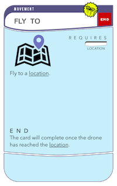

# CardKit

Welcome to CardKit. This is the fundamental framework for building IoT applications using a card-based methodology. CardKit defines a number of classes, structs, and protocols to encapsulate the creation and execution of card-based IoT programs.

CardKit is written in Swift and supports macOS, iOS, and tvOS.

CardKit depends on [Freddy](https://github.com/bignerdranch/Freddy) for JSON object serialization & deserialization.

## Definitions

### Card Descriptors & Cards

A `CardDescriptor` represents the information that would appear on a printed card. For example, the image below shows a sample annotated card containing various kinds of information.


A `CardDescriptor` contains a `CardIdentifier` which is used to uniquely identify the card. The `CardIdentifier` consists of the following information:

* **Name**. "Detect On Ground"
* **Path**. "Think/Detect". The path is used to group cards with similar functionality and make it easier for users to find cards by category when the number of cards is large. This is implemented by `CardPath`.
* **Version**. We keep track of a version number for each card in case that card's metadata ever changes or we need to support execution of multiple versions of the same card.

A `CardDescriptor` does not contain any information about the *implementation* of the card; it only contains the metadata associated with a card. The `Card` protocol is the bass for card implementations. Thus, all *logical* cards require two things to be defined: (1) a `CardDescriptor` and (2) a `Card`.

### Execution

Card execution works as shown below.


Cards are placed in Hands, and execution flows from the first hand to the last hand.  Cards in a hand are executed in parallel. Hands are executed sequentially. Cards may produce outputs (called Yields) which may be used by cards in subsequent hands.

### Card Types

There are five different kinds of base cards in `CardKit`,

#### Action

Action cards are used to perform an action with a physical device. For example, the following card would cause a drone to fly to a specified location.



`ActionCardDescriptor` defines the base card descriptor for an `ActionCard`. Action cards may accept inputs from other cards (`AcceptsInputs`), they may be bound to `TokenCards` to drive physical activities (`AcceptsTokens`), they may produce data that can be used by other downstream cards (`ProducesYields`), and they may trigger execution state changes (`Satisfiable`).

#### Deck

Deck cards are used to modify the execution logic of the Deck, such as ending execution (default) or repeating the deck. Their implementation details are TBD right now.

#### Hand

Hand cards are used to modify the execution logic of a Hand, such as ending when all End conditions are satisfied (default) or when only one of them are. Branching logic is also handled by Hand cards. The implementation details of Hand cards are TBD right now.

#### Input

Input cards are used to provide concrete, user-specified inputs to an Action card. An example Input card is shown below.


Input cards are similar to Action cards in that both produce some piece of data that is used by a card (called a Yield). In the case of Input cards, that data will always be user-specified. In the case of Action cards, that data will be computed based on the side-effects of executing the Action card.

The implementation of `InputCardDescriptor` conforms to the `ProducesYields` protocol, although by convention an `InputCard` will only (and always) produce one yield.

#### Token

Token cards represent the physical IoT hardware. Implementations of Token cards (from the class `TokenCard`) are designed to communicate with IoT hardware to perform the requisite actions as specified by the CardKit program. For example, a `DroneTokenCard` might be created to control a drone. It would be responsible for communicating with the drone over a separate API in response to the execution of the`ActionCard`s in the CardKit program.

### Yields

An `ActionCard` may produce some amount of data upon its execution. For example, a card that performs a computation to detect the location of an object in an image may *yield* the location of the object. These yields can then be used as Inputs to downstream cards (cards defined in later hands).

### End Flag

Cards may execute indefinitely or their execution may halt upon some condition. For example, a card that reads data from a humidity sensor may continuously perform these readings; a card that controls a drone to fly to a particular location may cease execution once the drone has reached that location. These two execution styles are captured by the End Flag.

The End Flag is captured by the `Satisfiable` protocol; a card is "satisfied" once it's end condition has been met.

## Implementation Details

### Card Assets

Card assets are all of the material needed to render the card on screen (e.g. a PNG rendering of the card). They are captured by the `CardAssetCatalog`, whose implementation is TBD at this moment.

### Input Card Slots

Cards contain a number of `InputCardSlots` representing "slots" or "sockets" to which Inputs may be bound. `InputCardSlots` should be statically defined in a struct inside of the Card's implementation. Note that there is a kind of circular reference between the static definition of a card descriptor referring to an `InputCardSlot`, and an `InputCardSlot` referring to a `CardDescriptor`. This seems to be okay in Swift. For example, this is the definition of `CKTimer`:

```
extension CKDescriptors.Action.Trigger.Time {
    /// Descriptor for Timer card
    public static let Timer = ActionCardDescriptor(
…
        // reference to the static InputCardSlot
        inputs: [CKTimer.Input.Duration],
…
    }

public class CKTimer: ActionCard {
…
    public struct Input {
        private init() {}
        /// the static InputCardSlot
        public static let Duration = InputCardSlot(
            identifier: "Duration",
            descriptor: CKDescriptors.Input.Time.Duration,
            isOptional: false)
    }
…
```

## Coding Principles

### Serialization

Our intention is for CardKit "programs" to be specified entirely in JSON to allow for portability across devices. For example, an iOS app may be created to allow a programmer to create a CardKit program. That program ought to be serializable and transferred to a tvOS app which is responsible for it's execution. Thus, many (if not all?) of the structs and classes defined in CardKit are `JSONEncodable` and `JSONDecodable` using the Freddy framework.

### Card Descriptors & Implementations

Card Descriptors are intended to encapsulate all of the metadata associated with a card. Card Implementations are intended to capture the run-time configuration of cards, as well as the executable implementations of cards.

We statically define the struct `CKDescriptor` to contain descriptors for the entire hierarchy of CardKit cards. Each descriptor is defined statically because its metadata will not change at run time. For example, the descriptor of the `Angle` card is defined under `CKDescriptors.Input.Location.Angle`. In order to preserve locality of related concepts, both the definition of the `Angle` descriptor, as well as it's implementation `CKAngle`, are contained in the `CKAngle.swift` file.

At runtime, we may instantiate any number of `CKAngle` instances. Thus, specific parameter bindings are handled at the instance level. For example, `CKAngle` is an `InputCard` which provides an angle in degrees. The `init()` method looks like this:

```
init() {
	super.init(with: CKDescriptors.Input.Location.Angle)
}
```

`init()` ensures this instance of `CKAngle` is mapped to the descriptor for the `Angle` card. At the point of initialization, `CKAngle` is not carrying any input value. This situation is okay, as the user may not have specified an input value yet in the user interface when constructing the CardKit program.

To set the input value for `CKAngle`, this method is used:

```
func setAngle(inDegrees degrees: Double) {
	do {
		try self.bindYieldData(degrees)
	} catch let error {
		…
	}
}
```

`bindYieldData()` is a generic function defined by `InputCard` that knows how to take a value and box it into the correct `YieldBinding` (or it throws an error if the given type is not supported).

Note that each `InputCard` implementation may define it's own API for how it's values get set, as `InputCard`s may accept different data types from each other.

### Naming

We follow a few naming guidelines in CardKit:
* Card Implementation names are prefixed with `CK` to signify that it is a CardKit card implementation.
* Protocols are named with verbs according to the abilities they provide. For example, `ProducesYields` makes it clear that the card will produce Yields, and `Executable` makes it clear that the card can be executed.
* `Card`, `Hand`, and `Deck` represent the core concepts in CardKit. `Card` is a protocol because there are multiple kinds of cards with radically-differing base implementations (`ActionCard`, `InputCard`, `TokenCard`, etc.). `Hand` and `Deck` are classes because there are only one type of these.

### Yield Boxing

Due to limitations in Swift reflection, we use an `enum` to box `Yield` types. This is because we are not able to instantiate a reference to a type from it's String name, as would be given in the JSON representation of a CardKit program (`NSClassFromName()` does not work for `struct` types).

The box types are defined in `Yield.swift`. Some of the standard Swift types are supported (`Int`, `Double`, `String`, `NSData`, `NSDate`), plus some additional types that are useful for IoT applications (`YieldCoordinate2D`, `YieldCoordinate2DPath`, `YieldCardinalDirection`, etc.). Note that the structs that back the Yield boxes are prefixed with "Yield" to specify that they are used exclusively for Yields.

## Building

We use Carthage to manage our dependencies. Run `carthage bootstrap` to build all of the dependencies before building the CardKit Xcode project.

## Contributing

If you would like to contribute to CardKit, we recommend forking the repository, making your changes, and submitting a pull request.
