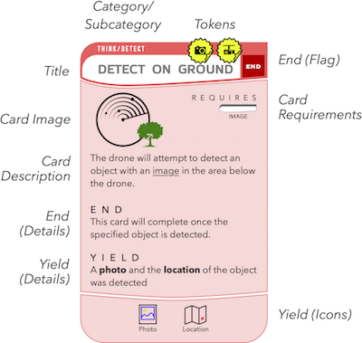

# CardKit

Welcome to CardKit. This is the fundamental framework for building IoT applications using a card-based methodology. CardKit defines a number of classes, structs, and protocols to encapsulate the creation and execution of card-based IoT programs.

CardKit is written in Swift and supports macOS, iOS, and tvOS.

CardKit depends on [Freddy](https://github.com/bignerdranch/Freddy) for JSON object serialization & deserialization.

The [CardKit Runtime](https://github.ibm.com/CMER/card-kit-runtime) provides support for validating and executing CardKit programs.

## Card Descriptors & Cards

A `CardDescriptor` represents the information that would appear on a printed card. For example, the image below shows a sample annotated card containing various kinds of information.



A `CardDescriptor` contains a host of information used to describe the card:

* **Card Type**: There are five types of cards in CardKit: Action, Deck, Hand, Input, Token. These are described in the Card Types section below.
* **Name**. The name of the card.
* **Path**. Paths are used to group cards with similar functionality, making it easier to find cards when the number of cards is large. Card paths are implemented by the `CardPath` struct.
* **Version**. Version numbers are used to keep track of cards in case a card's metadata ever changes, or we need to support execution of multiple versions of the same card.
* **Asset Catalog**. An Asset Catalog contains information about all assets needed to render the card on screen (e.g. a PNG rendering of the card, textual descriptions, etc.)

A `CardDescriptor` does not contain any information about the *implementation* of the card; rather, it only contains the metadata associated with a card. The mapping between a `CardDescriptor` and it's implementation is managed by `CardKit Runtime`.

The `Card` protocol, plus a set of associated base classes (`ActionCard`, `DeckCard`, `HandCard`, `InputCard`, and `TokenCard`) are the basis for card instances. A card's *instance* tracks information about how the card is bound to other cards and in which hand a card appears. For example, an `InputCardDescriptor` may specify that an Input card should contain a `Double` value. The corresponding `InputCard` instance would track *which* `Double` was assigned to the Input card (e.g. "5.0").

Card instances use reference semantics (they are classes, not structs). Usually, equality testing using reference semantics resorts to pointer comparison (e.g. do reference A and reference B point to the same memory address). For our purposes, because we want to serialize card programs as JSON, we need an alternative mechanism to specify *which* card instances are being referenced by *other* card instances. For example, an `ActionCard` that is bound to an `InputCard` needs to know which `InputCard` instance to which it is bound. To enable this, all `*Card` instances contain a UUID-based `CardIdentifier`, and instance equality is defined as having matching `CardIdentifier`s.

With the separation of card descriptors and card instances, all *logical* cards require two things to be defined: (1) a `CardDescriptor` (in `CardKit.swift`) and (2) a `Card` instance class that inherits from one of `ActionCard`, `DeckCard`, `HandCard`, `InputCard`, or `TokenCard`.

## Card Types

There are five different types of cards in `CardKit`.

### Action

Action cards are used to perform an action with a physical device. For example, the following card would cause a drone to fly to a specified location.


`ActionCardDescriptor` defines the base card descriptor for an `ActionCard`. Action cards may accept inputs from other cards (`AcceptsInputs`), they may be bound to `TokenCards` to drive physical activities (`AcceptsTokens`), they may produce data that can be used by other downstream cards (`ProducesInput`, `ProducesYields`), and they may trigger execution state changes (`Satisfiable`).

### Deck

Deck cards are used to modify the execution logic of the Deck, such as ending execution (the default) or repeating the deck.


### Hand

Hand cards are used to modify the execution logic of a Hand. Arbitrary Boolean logics are supported with Hand cards, such that a Hand card's own satisfaction is based on the satisfaction of the cards to which it is attached. Branching and Repetition logic are also handled by Hand cards.


### Input

Input cards are used to provide concrete, user-specified inputs to an Action card. An example Input card is shown below.


Input cards are similar to Action cards in that both produce some piece of data that is used by a card. For an `ActionCard`, this is called a `Yield` and it is computed at run-time based on the effects of executing the Action card. For an `InputCard`, this data is always user-specified at the time of program construction.

The `InputSlot` class manages the Input slots of an Action card. Each `InputSlot` has a human-understandable name (e.g. "Duration" or "Location") and a corresponding `InputType` (stored internally as a `String`).

`ActionCard` keeps track of `InputSlot` binding using the `InputSlotBinding` enum; a slot may be unbound, bound to an `InputCard`, or bound to the `Yield` of an `ActionCard`.

### Token

Token cards represent physical IoT hardware. Token card implementations, based on the `ExecutableTokenCard` class in `CardKit Runtime`, are designed to communicate with IoT hardware to perform the requisite actions as specified by the CardKit program. For example, a `Drone` token implementation may be created to control a drone. It is the responsibility for the Token card's implementation to perform any actual communication with the drone (or other IoT hardware).

Tokens adhere to the `Consumable` protocol to specify whether their use is consumed by an `ActionCard`. If a token is consumed, its use by one `ActionCard` prevents its use by another `ActionCard` (e.g. a camera that can only respond to one command at a time). Tokens that are not consumed may be bound to multiple `ActionCard`s in the same hand. Token consumability applies only within the current Hand; a Token that was consumed in a previous hand may be used by a new `ActionCard` in the current hand.


## Execution

Card execution works as shown below.


Cards are placed in Hands, and execution flows from the first hand to the last hand.  Cards in a hand are executed in parallel. Hands are executed sequentially. Cards may produce outputs (called Yields) which may be used by cards in subsequent hands. A Deck encapsulates a sequence of Hands, and is considered a single, standalone CardKit program.

Note that `CardKit` only provides facilities for defining the structure of a CardKit program. The [CardKit Runtime](https://github.ibm.com/CMER/card-kit-runtime) provides support for validation and execution of CardKit programs.

## Card Concepts

### Yields

An `ActionCard` may produce some amount of data upon its execution. For example, a card that performs a computation to detect the location of an object in an image may *yield* the location of the object. These yields can then be used as Inputs to downstream cards (cards that are defined in later hands).

### End Flag

Cards may execute indefinitely or their execution may halt upon some condition. For example, a card that reads data from a humidity sensor may continuously perform these readings; a card that controls a drone to fly to a particular location may cease execution once the drone has reached that location. These two execution styles are captured by the End Flag.

The End Flag is captured by the `Satisfiable` protocol. A card is considered "satisfied" once its end condition has been met.

### Slots

Action cards contain a set of `InputSlots` and `TokenSlots` representing "slots" or "sockets" to which Inputs and Tokens may be bound. These slots are statically defined along with the static definition of the card's descriptor. For example, here is how the `Timer` card is defined:

```
/// Descriptor for Timer card
public static let Timer = ActionCardDescriptor(
…
	inputs: [
		InputSlot(name: "Duration", type: Int.self, isOptional: false)
	],
…
}
```

Token slots are defined in a similar fashion.

### Binding

Cards are bound to each other when the yields from one card are used as inputs to another. The following bindings are valid:

* `ActionCard` to `ActionCard` – this is a Yield relationship
* `InputCard` to `ActionCard` – this is an Input relationship
* `TokenCard` to `ActionCard` – this is a Token relationship
* Value to `InputCard` – this binds a specific data value (wrapped in an `InputDataBinding`) to an Input card

The `bind()` methods are implemented generically, enabling any kind of data to be bound to a card. However, there are a few caveats:

* Input slots are specified with the type of data they are expecting. Thus, a type-checking step is performed during binding to ensure that the type of the given data matches the expected type.
* Input bindings need to serialize to and from JSON. Because Swift does not currently allow instantiating an instance of a struct from its String type name (e.g. cannot instantiate a struct `Foo` from the string "Foo"), we box the values of bound input using `InputDataBinding` enum. This enum contains two cases: 
	* `.unbound`: the slot has not been bound
	* `.bound(JSON)`: a `JSON` value has been bound to the slot

This way, cards can bind data to any Swift type so long as it conforms to `JSONEncodable & JSONDecodable`.

## Hands, Decks & Deck Building

A Hand consists of a set of Cards. Hands may only contain `ActionCard`s and `HandCards`; thus, a Hand may not contain a `DeckCard`. A Hand implicitly contains `InputCards`s , as they are bound to an `ActionCard`. A Hand may not include unbound `InputCard`s.

A Deck is an ordered sequence of Hands. Execution of a Deck will always begin with the first Hand. However, `HandCard`s may alter the execution logic of a Deck (e.g. a `Branch` card may jump to a different hand than the next one in sequence).

As with `Card` instances, `Hand`s contain a UUID-based identifier, enabling references to be made from a branching `HandCard` to another `Hand` in the Deck.

### Hand Representation

Hands are represented as a forest of `CardTree`s. Each node in a `CardTree` is represented by a `CardTreeNode`, which may be an `ActionCard`, a `UnaryLogicCard` (used for NOT logic), or a `BinaryLogicCard` (used for AND and OR logics). Each `CardTree` has a unique UUID-based identifier.

A Hand also contains a set of subhands to which it may branch. These subhands are stored in the Hand, as opposed to in the parent Deck, because once a branch is taken from a Hand, it cannot be returned from. This rule ensures that Yield dependencies remain hierarchically correct. For example, consider the following program structure:

```
Deck D = 
  Hand_1
  Hand_2
  Hand_3 --(branch)--> Hand_3a
  Hand_4
```

Deck `D` contains four hands, `Hand_1`, `Hand_2`, `Hand_3`, and `Hand_4`. `Hand_3a` is contained within `Hand_3` as a subhand. The possible execution orders of this Deck are therefore,

* `Hand_1 -> Hand_2 -> Hand_3 -> Hand_4`
* `Hand_1 -> Hand_2 -> Hand_3 -> Hand_3a`

By design, we do not allow `Hand_4` to execute after `Hand_3a`. Thus, it is stored as a subhand of `Hand_3` rather than as another Hand in the Deck.

### Hand Satisfaction

Satisfaction of a hand occurs when either of the following conditions are met:

* A branching `CardTree` is satisfied, in which case the next Hand to be executed will be the one targeted by the `BranchHandCard`.
* All `CardTrees` are satisfied, in which case the next Hand to be executed will be the next one in the Deck.

Empty `CardTree`s are considered satisfied.

### Branching

`BranchHandCard`s are used to specify branching logic. Each `BranchHandCard` maintains the identifier of the `CardTree` from which to branch, as well as the identifier of the `Hand` to which to branch. This target Hand must be a subhand of the Hand.

### Deck Builder Syntax

To enable a rapid construction of CardKit programs, we introduce some syntactic sugar using operator overloading.

|  Operator  |  Function  |  Examples  |
|---|---|---|
|  `<-`  |  Binding  |  Data value to `InputCard`, `ActionCard` to `ActionCard`, `InputCard` to `ActionCard`)  |
| `!`  |  Logical Not  |  Negates an `ActionCard`  |
|  `&&`  |  Logical And  |  And between two `ActionCard`s, And between two `Hand`s by collapsing all `CardTree`s and ANDing them together  |
|  `||`  |  Logical Or  |  Or between two `ActionCard`s, Or between two Hands by collapsing all `CardTree`s and ORing them together  |
|  `+`  |  Combining  |  Combines cards to make a Hand, adds cards to an existing Hand, merges Hands, adds Deck cards to a Deck  |
|  `==>`  |  Sequencing  |  Sequences Cards and Hands into `[Hand]`  |
|  `%`  |  Sealing  |  Seals a card into a Hand, seals a `[Hand]` into a `Deck`  |

Here is an example of a small, complete CardKit program using the Deck Builder syntax.

```
let deck = (
	CKTestCards.Action.NoAction ==> 
	CKTestCards.Action.NoAction
)%        
```

The `==>` operator is used to specify a sequence of Hands. Note that we are able to produce a `Hand` containing an `ActionCard`, even though we specified `CKTestCards.Action.NoAction` which is an `ActionCardDescriptor`. This behavior is possible because the internal specification of `==>` will create an `ActionCard` instance when given an `ActionCardDescriptor`.

The `%` operator is used to "seal" a deck from a sequence of hands.

In addition to the Deck Builder syntax, we also support an imperative syntax for building decks.

```
let deck = Deck()
let hand = Hand()
hand.add(CKTestCards.Action.NoAction.makeCard())
deck.add(hand)
```

Input bindings can also be specified using the Deck Builder syntax.

```
let card: ActionCard = CKTestCards.Action.AcceptsMultipleInputTypes <- CardKit.Input.Numeric.Real <- 5.0
```

Note that `card` is built using `ActionCardDescriptors` and `InputCardDescriptors`. Internally, the `<-` operator is creating an `ActionCard` instance and an`InputCard` instance, it is binding the value “5.0” to the `InputCard`, and it is binding the `InputCard` to the `ActionCard`.

A Hand containing `HandCard` logic is specified below.

```
let A = CKTestCards.Action.NoAction.makeCard()
let B = CKTestCards.Action.NoAction.makeCard()
let C = CKTestCards.Action.NoAction.makeCard()
let D = CKTestCards.Action.NoAction.makeCard()
let E = CKTestCards.Action.NoAction.makeCard()
let F = CKTestCards.Action.NoAction.makeCard()
let hand = ((A && B) || (C && D)) + E + !F
```

The operators `&&`, `||`, and `!` produce `HandCard`s with the respective Boolean operator, applied to the specified cards. The operator `+` is used to combine cards in a hand (e.g. without adding additional logic cards). Thus, the resulting Hand contains the following `CardTree`s:

```
   Tree 1        Tree 2    Tree 3
     OR            E         NOT
    /   \                     |
  AND   AND                   F
 /  \   /  \
A    B  C   D
```

Note that this hand will be considered satisfied when the following three conditions are met:

* Tree 1 is satisfied via `OR(AND(A,B), AND(C,D))`
* Tree 2 is satisfied via `E`
* Tree 3 is satisfied via `NOT(F)`

If this Hand contained a `BranchHandCard`, then the Hand would be satisfied only when the source `CardTree` of the branch was satisfied. This logic applies to Hands that contain multiple `BranchHandCard`s: the first one to be satisfied determines which subhand to which to branch.

## Coding Principles

### Serialization

Our intention is for CardKit programs to be specified entirely in JSON to allow for portability across devices. For example, an iOS app may be created to allow a programmer to create a CardKit program. That program ought to be serializable and transferred to a tvOS app which is responsible for it's execution. Thus, many of the structs and classes defined in CardKit are `JSONEncodable` and `JSONDecodable` using the Freddy framework.

### Static Card Descriptors

Card Descriptors encapsulate all of the metadata associated with a card. We statically define the struct `CardKit` to contain descriptors for the entire hierarchy of CardKit cards. For example, the descriptor of the `Integer` card is defined under `CardKit.Input.Numeric.Integer`. Each descriptor is defined statically because its metadata will not change at run time.

### Separation Between Specification and Runtime

We have an explicit separation between the specification of a CardKit program and its runtime execution. It is the responsibility of the `CardKit Runtime` library to map the Card Descriptors defined in `CardKit.swift` to class implementations that execute the logic for the card.

### Naming

We follow a few naming guidelines in CardKit.

* Protocols are named with verbs according to the abilities they provide. For example, `ProducesYields` makes it clear that the card will produce Yields, and `Executable` makes it clear that the card can be executed.
* We prefer simple noun-based names for concrete concepts. For example, Cards, Hands, and Decks are core concepts in CardKit; thus, their class names are `Card`, `Hand`, and `Deck`.
* We try to use value semantics (structs) wherever possible, although we really want to use inheritance in some places (e.g. `LogicHandCard : HandCard`), so we use classes in those cases. But, because of the Serialization requirement, we use value-like semantics when performing equality testing for these classes (e.g. using `CardIdentifier` and `HandIdentifier`).
* Extensions to Swift types are specified in `Extensions/(Type)Extension.swift`

### Input Boxing

Due to limitations in Swift reflection, we use an `enum InputDataBinding` to box bound `Input` values. This is because we are not able to instantiate a reference to a type from it's String name, as would be given in the JSON representation of a CardKit program (`NSClassFromName()` does not work for `struct` types). Note that the value stored inside the box is a `JSON` object, enabling any type that conforms to `JSONEncodable & JSONDecodable` to be boxed.

When removing bound values from the box, we must be explicit about its type. Internally, the `CardKit Runtime` attempts to construct an object instance for the type specified. For example, an `ExecutableActionCard` may retrieve the value bound to slot "A" as follows.

`let a: Double = self.value(forInput: "A")`

If the `InputSlot` "A" is `.bound` and the `JSON` value contained within it is convertible to `Double`, then the method returns the correct value. Otherwise, it returns `nil`.

## Building

We use Carthage to manage our dependencies. Run `carthage bootstrap` to build all of the dependencies before building the CardKit Xcode project.

## Contributing

If you would like to contribute to CardKit, we recommend forking the repository, making your changes, and submitting a pull request.

## Contact

The authors of CardKit are members of the Center for Mobile Enterprise Research in IBM Research.

* Justin Weisz, jweisz@us.ibm.com
* Justin Manweiler, jmanweiler@us.ibm.com
* Saad Ismail, saad@us.ibm.com

